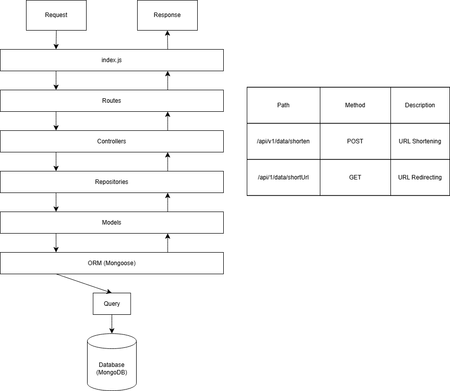

# Setup Project

## Set up folder structure

```
project_root/
├── .env
├── index.js
├── package.json
├── README.md
└── src/
   ├── controllers/
   ├── models/
   ├── repositories/
   └── routes/
```

Let's Break down the details regarding each folder:

- project_root: The root directory for the project. All project files and folders are allocated within the root directory.
- index.js: This file is the main entry point of the application. It configures all connections between components, database connection and starting the server.
- package.json: Crucial metadata, such as dependencies, version, scripts, etc., regarding the project are included in this file
- src/: This folder contains all necessary code of the application
- controllers/: This folder contains the controller files. Controllers are responsible for hadling incoming requests, processing data, and returning responses. This acts as a bridge between routes and repositories.
- models/: This folders contains information regarding the definition of data models. A model mainly represents the database schema or the data structure of an entity.
- repositories/: This folder composites the data access layer and repository files. A repository mainly encapsulates the internal logic regarding the interaction with databases and other data sources.
- routes/: This folder defines all endpoints and associated request handling. Routes handles the necessary operations when a URL is accessed by a client by calling appropriate controler functions and generate the response.

The diagram belows show the interaction between different components:



# Initialize Project and Install Dependencies

Inintlize a new Node.js project and install required dependencies:

```
# Initialize Node.js project
npm init -y

# Install dependencies
npm install express mongoose dotenv
```

# Configure .env

In the root of your project, create a file named .env and add your MongoDB connection URL.
