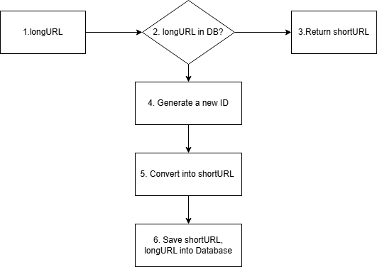
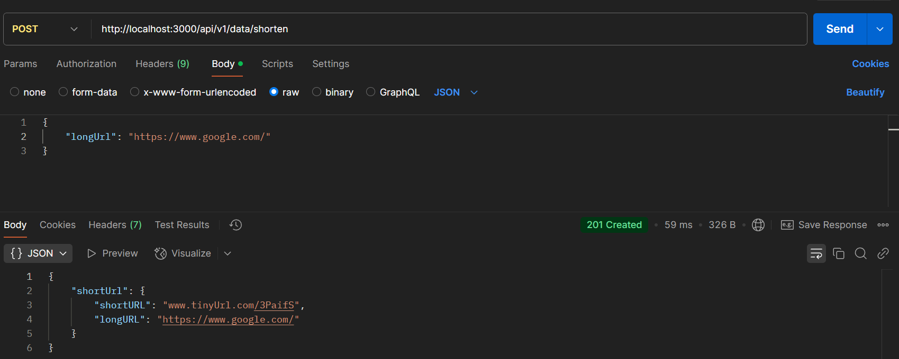
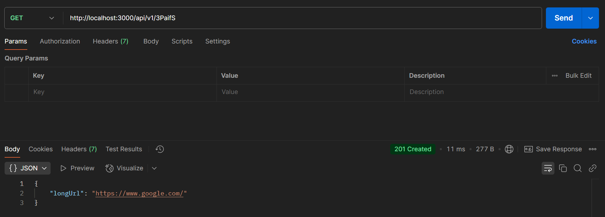

# Database choice

There are 2 potential choices for choosing the database: Hash Table & Relational Database

## Hash Table

Hash table may not be feasible solution as it is limited by expensive memory resource.

## Relational Database

A more possible solution option would be relational database. The data model would be <shortUrl, longUrl>

# Hash function

There are 2 options for hash functions, including Hash + Collision resolution & Base 62 Conversion. In this example, we will use the Base 62 conversion option.

## Base 62 conversion

This approach leverages the Base 62 Conversion. The input longURL will be converted into a hash value before being cut down to only first 8 characters. Once the hashed value is transformed into an ID, it will be converted into the base 62 shortURL for storing in the database.

# System work flow



## Create database model

```javascript
const mysql = require("mysql2");
const dotenv = require("dotenv");

dotenv.config();

// Configurate the pool
const pool = mysql
  .createPool({
    host: process.env.MYSQL_HOST,
    user: process.env.MYSQL_USER,
    password: process.env.MYSQL_PASSWORD,
  })
  .promise();

class URLModel {
  // Initialize the urLTable within the database
  async initalizeTable() {
    try {
      const result = await pool.query(`
        CREATE TABLE urlTable (
        id INT AUTO_INCREMENT PRIMARY KEY,
        shortURL VARCHAR(255),
        longURL TEXT NOT NULL)
        `);
      return result;
    } catch (error) {
      return false;
    }
  }
}

module.exports = new URLModel();
```

## Create the Repository

```javascript
const commands = require("../SQLCommands/commands");

class URLRepository {
  async handleUrlRedirect(shortUrl) {
    // Find the short URL in the database
    const result = await commands.urlRedirect(shortUrl);
    if (!result) {
      throw new Error("Short URL not found");
    }
    return result.longURL;
  }

  async handleGenerateShortUrl(longUrl) {
    const url = await commands.findLongUrl(longUrl);

    // Check if the url is already inside the database
    if (url) {
      return url.shortURL;
    } else {
      const shortUrl = commands.hashValueGenerate(longUrl);

      // Insert the short url into the database
      const result = await commands.generateShortURL(shortUrl, longUrl);
      return result;
    }
  }
}

module.exports = new URLRepository();
```

## Create the Express Route

```javascript
const express = require("express");
const router = express.Router();

const UrlControllers = require("../controllers/url");

// Redirect to long URL
router.get("/:shortUrl", UrlControllers.urlRedirect);

// Generate short URL
router.post("/data/shorten", UrlControllers.generateShortUrl);

module.exports = router;
```

## Create Express Controllers

```javascript
const UrlRepository = require("../repositories/url");

class UrlController {
  // Generate short URL
  async generateShortUrl(req, res) {
    try {
      const { longUrl } = req.body;
      // Check if the long url is in the request body
      if (!longUrl) {
        return res.status(400).json({ error: "URL is required" });
      }

      UrlRepository.handleGenerateShortUrl(longUrl)
        .then((shortUrl) => {
          return res.status(201).json({ shortUrl });
        })
        .catch((error) => {
          return res.status(500).json({ error: error.message });
        });
    } catch (error) {
      return res.status(500).json({ error: "Unable to generate short URL" });
    }
  }

  //Redirect to the long URL
  async urlRedirect(req, res) {
    try {
      const { shortUrl } = req.params;
      // Check if short url is in the request params
      if (!shortUrl) {
        return res.status(400).json({ error: "Short URL is required" });
      }

      // Fetch the long URL based on the short URL
      UrlRepository.handleUrlRedirect(shortUrl)
        .then((longUrl) => {
          return res.status(201).json({ longUrl });
        })
        .catch((error) => {
          return res.status(500).json({ error: error.message });
        });
    } catch (error) {
      return res.status(500).json({ error: "Unable to redirect to long URL" });
    }
  }
}

module.exports = new UrlController();
```

## Setup the SQL commands file

```javascript
const mysql = require("mysql2");
const dotenv = require("dotenv");
const URLModel = require("../models/urlModel");

dotenv.config();

// 2 external packages for base 62
const base62 = require("base-62");
const crypto = require("crypto");

// Configurate the pool
const pool = mysql
  .createPool({
    host: process.env.MYSQL_HOST,
    user: process.env.MYSQL_USER,
    password: process.env.MYSQL_PASSWORD,
  })
  .promise();

// Defining the Commands Class
class sqlCommands {
  // Generate the hashed shortURL
  hashValueGenerate(longUrl) {
    // Generate short ID for long URL based on 62-base conversion method
    const hash = crypto.createHash("sha256").update(longUrl).digest("hex");
    const shortHash = hash.slice(0, 8);
    const decimal = parseInt(shortHash, 16);

    const shortID = base62.encode(decimal);

    // Generate short URL
    const shortUrl = "www.tinyUrl.com/" + shortID;

    return shortUrl;
  }

  // Create a new database
  async createDatabase() {
    try {
      await pool.query(`
            CREATE DATABASE URLShortener;
            `);
      await URLModel.initalizeTable();
      // No need to return anything here
    } catch (error) {
      // Check if the error is due to database already existing
      if (error.code === "ER_DB_CREATE_EXISTS") {
        return; // Return nothing if database already exists
      } else {
        throw error; // Re-throw the error for other cases
      }
    }
  }

  // Retrieve the newly created shortURL
  async retrieveUrlById(id) {
    const [result] = await pool.query(
      `
      SELECT shortURL, longURL
      FROM urlTable
      WHERE id = ?;
      `,
      [id]
    );

    return result[0];
  }

  // Check whether the longURL is already existed
  async findLongUrl(longURL) {
    await pool.query("USE URLShortener");
    const [result] = await pool.query(
      `
      SELECT shortURL
      FROM urltable
      WHERE longURL = ?;
      `,
      [longURL]
    );

    return result[0];
  }

  // Redirect shortURL to longURL
  async urlRedirect(shortURL) {
    await pool.query("USE URLShortener");
    const convertedShortURL = "www.tinyUrl.com/" + shortURL;
    const [result] = await pool.query(
      `
      SELECT longURL
      FROM urlTable
      WHERE shortURL = ?;
      `,
      [convertedShortURL]
    );
    return result[0];
  }

  // Generate new shortURL
  async generateShortURL(hashedURL, longURL) {
    await pool.query("USE URLShortener");

    const result = await pool.query(
      `
      INSERT INTO urlTable (shortURL, longURL)
      VALUES (?, ?);
      `,
      [hashedURL, longURL]
    );

    const id = result[0].insertId;
    return this.retrieveUrlById(id);
  }
}

module.exports = new sqlCommands();
```

## Configure the Repository

```javascript
const commands = require("../SQLCommands/commands");

class URLRepository {
  async handleUrlRedirect(shortUrl) {
    // Find the short URL in the database
    const result = await commands.urlRedirect(shortUrl);
    if (!result) {
      throw new Error("Short URL not found");
    }
    return result.longURL;
  }

  async handleGenerateShortUrl(longUrl) {
    const url = await commands.findLongUrl(longUrl);

    // Check if the url is already inside the database
    if (url) {
      return url.shortURL;
    } else {
      const shortUrl = commands.hashValueGenerate(longUrl);

      // Insert the short url into the database
      const result = await commands.generateShortURL(shortUrl, longUrl);
      return result;
    }
  }
}

module.exports = new URLRepository();
```

## Setup the Express Server

```javascript
const express = require("express");
const dotenv = require("dotenv");
const urlRoutes = require("./src/routes/urlRoutes");
const commands = require("./src/SQLCommands/commands");

dotenv.config();
const app = express();
const PORT = process.env.PORT || 3000;

//Middleware
app.use(express.json());

commands.createDatabase();

//Routes
app.use("/api/v1", urlRoutes);

//Start the server
app.listen(PORT, () => {
  console.log(`Server is running on port ${PORT}`);
});
```

# Start the server

```javascript
node index.js
```

# Use Postman to test the API

### URL Generate



### URL Redirect


