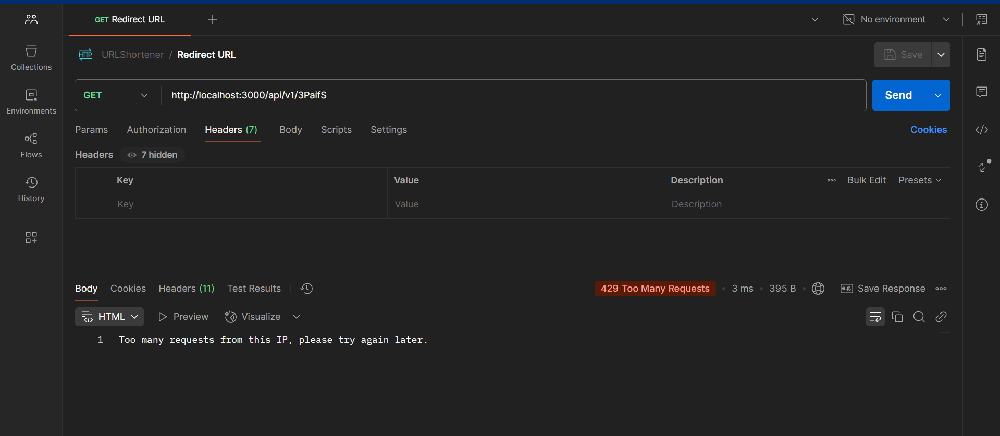

# Rate limiting

Rate limiting is a technique used to control the amount of traffic or requests that are sent to a server or API within a specific time frame, which would prevent abuse of your API.

To add rate limiter, we will use express-rate-limit middleware.

## Install the Rate Limiting Package

```
npm i express-rate-limit
```

## Configure Rate Limiting

In the index.js file, add the rate limiting configuration to all of you requests:

```javascript
const express = require("express");
const dotenv = require("dotenv");
const urlRoutes = require("./src/routes/urlRoutes");
const commands = require("./src/SQLCommands/commands");
const rateLimit = require("express-rate-limit");

dotenv.config();
const app = express();
const PORT = process.env.PORT || 3000;

// Configure the rate limiter
const limiter = rateLimit({
  windowMs: 15 * 60 * 1000, // 15 minutes
  max: 5, // Limit each IP to 100 requests per windowMs
  keyGenerator: (req) => {
    return req.ip; // Use the IP address as the key
  },
  message: "Too many requests from this IP, please try again later.", // Optional message
});

// Apply rate limiting to all requests
app.use(limiter);

// Middleware
app.use(express.json());

// Initialize the database
commands.createDatabase();

// Routes
app.use("/api/v1", urlRoutes);

// Start the server
app.listen(PORT, () => {
  console.log(`Server is running on port ${PORT}`);
});
```

In this example, we have limited each IP address to send only 5 requests per 15 minutes. You can configure the max and windowMS number based on your specification.


