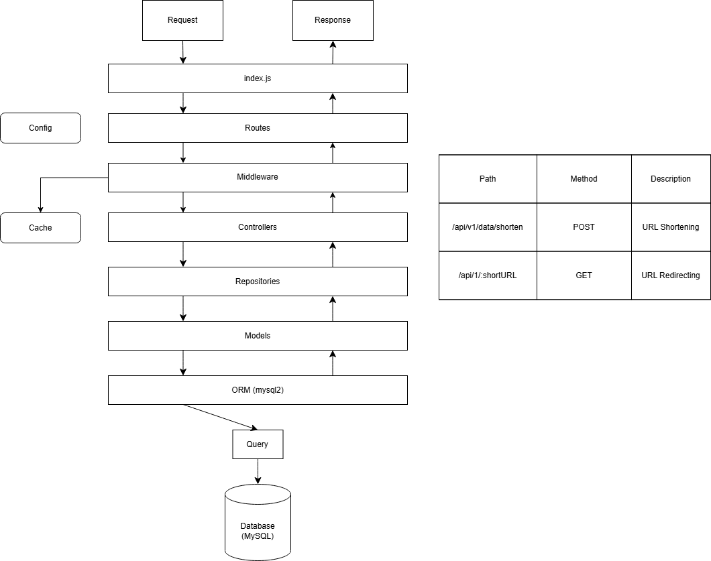
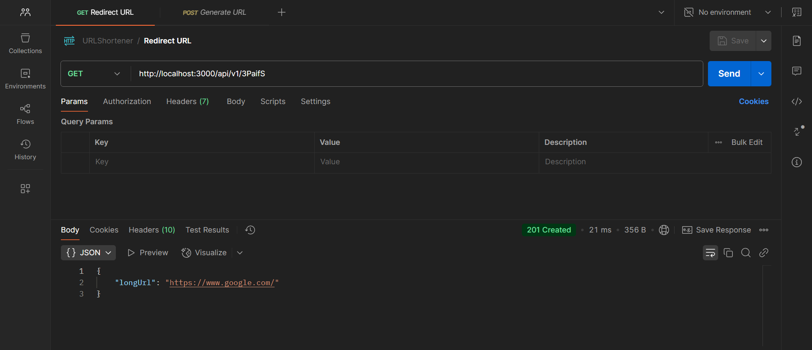
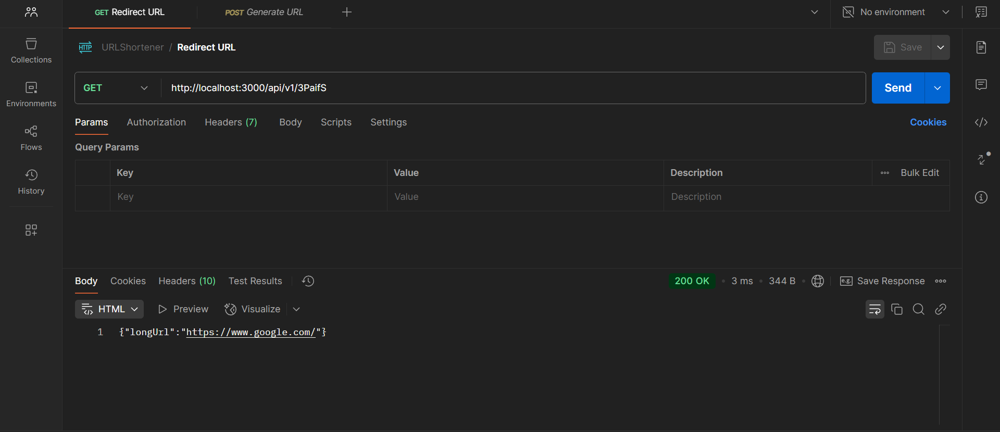

# Adding cache system

Cache is a technique that stores frequently used data and instructions to improve the read performance.



Database queries or calculations can be expensive. Implementing caching would store the results temporarily in memory, thus reducing the load on database and improve the API's response time.

## Install Memory Cache Package

```
npm i memory-cache
```

## Create a Cache Middleware

Create a new middleware folder and configure the cacheMiddleware.js file:

```javascript
const cache = require("memory-cache");

function cacheMiddleware(duration) {
  return (req, res, next) => {
    const key = "__express__" + req.originalUrl || req.url;
    const cachedBody = cache.get(key);
    if (cachedBody) {
      res.send(cachedBody);
      return;
    } else {
      res.sendResponse = res.send;
      res.send = (body) => {
        cache.put(key, body, duration * 1000);
        res.sendResponse(body);
      };
      next();
    }
  };
}

module.exports = cacheMiddleware;
```

## Applying Caching to the Routes file

In the routes/urlRoutes.js file, implement the cache middleware to the route that redirects the longURL:

```javascript
// routes/urlRoutes.js
const express = require("express");
const router = express.Router();
const cacheMiddleware = require("../middlewares/cacheMiddleware");
const UrlControllers = require("../controllers/urlControllers");

// Redirect to long URL
router.get("/:shortUrl", cacheMiddleware(300), UrlControllers.urlRedirect);

// Other Routes
```

Now that your API already included memory-cache, the load on databases would be reduced for a specific duration. This can be useful for improving the API's performance.

# Test with Postman

As we can see in the example, the retrieval time for the same longURL decreased to 3ms, which is 7 times faster.



